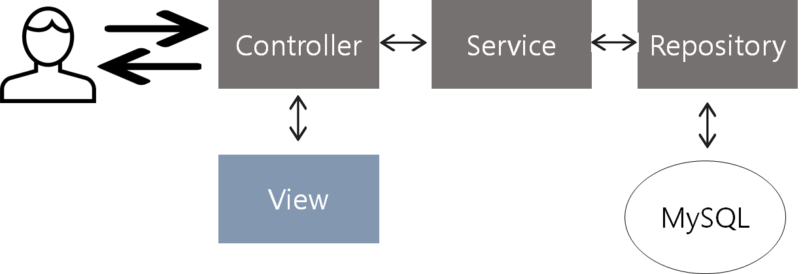
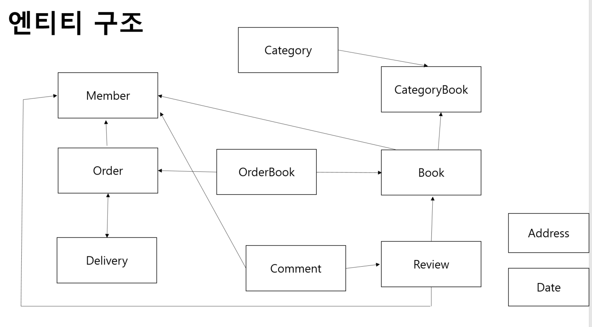
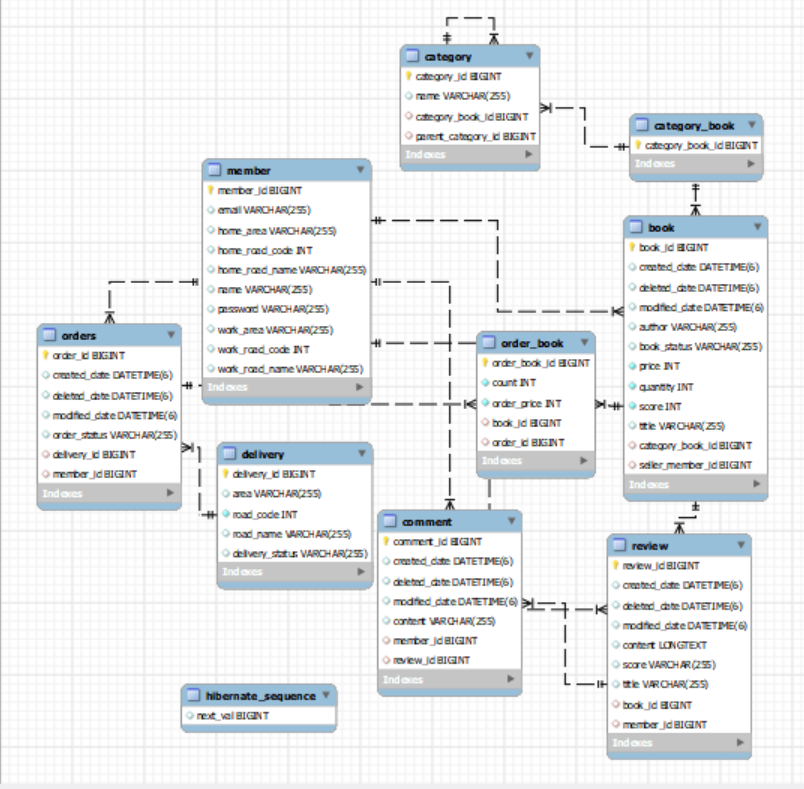
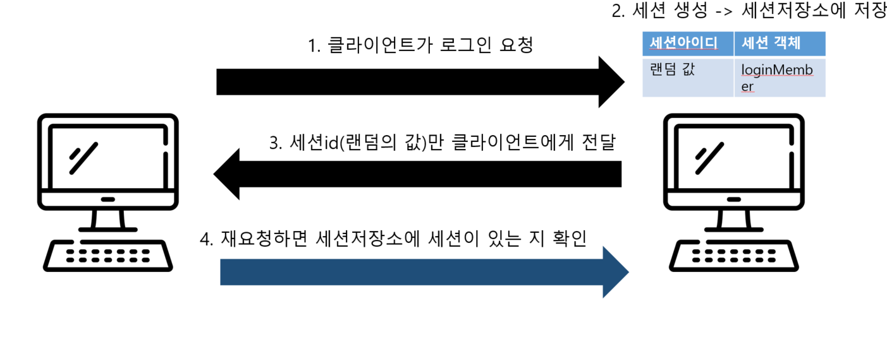
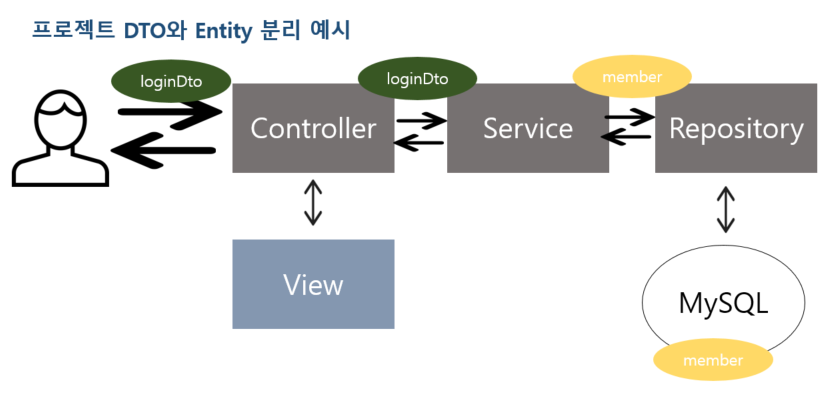
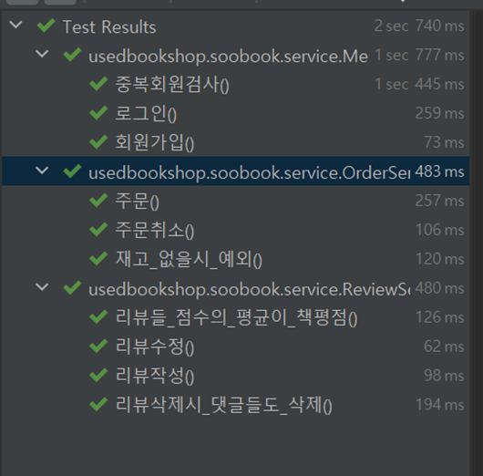

# 💡 프로젝트 소개

### SooBook

> 중고 책 거래 사이트
>

### 개발 기간

2022.09.18~(진행중)

# 💡 실행화면

<iframe width="636" height="338" src="https://www.youtube.com/embed/SNdy74XbPfQ" title="데이터베이스 최종 발표 실행 화면 영상1" frameborder="0" allow="accelerometer; autoplay; clipboard-write; encrypted-media; gyroscope; picture-in-picture" allowfullscreen></iframe>

- 홈 화면에서 베스트셀러를 확인할 수 있다.
- 회원가입, 로그인을 하면 마이페이지를 볼 수 있고 로그아웃을 할 수 있다.
- 로그인 한 사용자만 책을 판매할 수 있다.
- 책을 사면 산 수량만큼 책 재고가 줄어든다.
- 구매한 책의 리뷰를 작성하면 책의 평점이 업데이트 된다.


<iframe width="708" height="398" src="https://www.youtube.com/embed/N4A_q47xY18" title="데이터베이스 최종 발표 실행 화면 영상2" frameborder="0" allow="accelerometer; autoplay; clipboard-write; encrypted-media; gyroscope; picture-in-picture" allowfullscreen></iframe>
주문을 취소하면 책의 수량이 올라감.

# 💡 사용기술

### Front-End

- html, css
- thymeleaf
- bootstrap

### Back-End

- java11
- spring boot
- jpa
- mysql

### Build Tool

- gradle

# 💡 요구사항, 기능 소개

### 회원

- 회원은 회원가입, 로그인 할 수 있다.
- 로그인 한 회원은 마이페이지에서 자신의 주문 정보, 판매 정보, 리뷰 정보를 볼 수 있다.
- 이메일이 같은 회원은 있을 수 없다.

### 책

- 로그인 한 회원은 책을 판매할 수 있다.
- (책의 평점) == (리뷰들 평점의 평균)

### 주문

- 로그인 한 회원만 주문할 수 있다.
- 주문 성공 시 책의 수량이 줄어든다.
- 주문 취소 시 책이 수량이 늘어난다.
- 재고가 없으면 주문을 할 수 없다.

### 리뷰

- 로그인 한 회원 중에서 해당 책을 구매한 회원만 리뷰를 작성할 수 있다.
- 리뷰를 삭제하면 리뷰에 달린 댓글들도 삭제된다.

# 💡 프로젝트 아키텍처



- **Controller**

  User의 요청을 받고 응답을 해주는 역할을 담당

- **Service**

  핵심적인 비즈니스 로직을 담고 있다. (주문, 회원가입 등)

- **Repository**

  dbms에 접근하여 데이터를 저장, 수정, 삭제, 선벼하는 역할을 담당

- **View**

  화면에 무언가를 보여주기 위한 역할을 담당

  타임리프를 활용한 html


<aside>
☑️ MVC 패턴으로 레이어를 나눔으로써 비지니스 처리 로직과 사용자 인터페이스 요소들을 분리시켜 서로 영향없이 개발하였다.

</aside>

# 💡 엔티티 구조



- 엔티티들은 서로 일대일 연관관계 혹은 다대일 연관관계를 맺고있다.
- ‘다’에 해당하는 엔티티가 연관관계의 주인이며 외래키가 존재한다.

- `Category` : subCategories 속성과 parentCategory 속성이 다대일 관계이다. 연관관계 주인은 subCategories이며 데이터베이스에서 category 테이블이 self join을 하게 된다.
- `Address` : 임베디드 타입으로 쓰이며 Member 엔티티에서 homeAddress와 workAddress로 참조하고 있다.
- `Date` : Date는 jpa 영속성 컨텍스트에서 관리되는 엔티티는 아니며 `@MappedSuperclass` 어노테이션이 붙은 클래스이다. 객체의 입장에서 공통매핑정보를 사용하기 위해 쓰인다. 위 엔티티 구조에서는 Review, Comment, Book 에서 상속받아 쓰고 있다.
- `CategoryBook` : Category와 Book 엔티티가 다대다 관계인데 다대다는 구현이 복잡하고 수정이 어렵기 때문에 중간에 매핑테이블을 두기 위해 만든 엔티티이다.

# 💡 데이터베이스 구조



- 각 테이블의 pk인 id는 auto_increment 방식으로 의미 없는 값을 자동 생성하게 만들었다.
- `order` 가 예약어라서 테이블명으로 orders라는 이름을 사용했다.

# 💡 세부 구현 방법

## 로그인(세션, 쿠키)

로그인 기능을 http 세션, 쿠키로 구현하였다.



- 클라이언트가 로그인을 시도했을 때, 세션(랜덤 값인 세션아이디 + 세션 객체)이 생성되어 세션저장소에 저장된다.
- 클라이언트에게는 랜덤 값인 세션아이디만 전달한다.

  ➡️ 클라이언트에게 실제 객체는 숨기고 예상 불가능한 값인 랜덤 값을 넘김으로써 해킹을 방지한다.


- 클라이언트가 다시 요청했을 경우, 세션 저장소에서 세션이 있는지 확인한다.
- 세션이 있다면 로그인 유지, 없다면 로그아웃 처리된다.

## Dto ↔ Entity

`Dto` : 계층 간 데이터 교환을 위해 존재하는 객체로 getter/setter 메서드를 포함해야 한다.

`Entity` : 실제 데이터베이스와 매핑되는 핵심 클래스로 Setter 사용을 지양해야 한다.

이처럼 Dto와 Entity 차이로 Dto로 Entity를 철저히 분리해야 한다.

또한 사용자에게서 받은 데이터와 실제 db에 있는 값은 내용과 양의 차이가 있을 수 있다. 예를 들어 로그인 폼에서 자동 로그인 동의 정보도 넘어올 수 있지만 이는 엔티티에 넣어야 하는 정보가 아니다. 반대로 멤버 엔티티의 회사 주소는 로그인할 때 입력 받는 정보가 아니다.

이와 같은 이유로 사용자는 Dto로 데이터를 주거나 받고, entity는 서버 안에서만 사용되게 설계하였다.



dto와 entity를 변환하는 작업은 서비스 계층에서 이루어지도록 하였다.

## 생성자 대신 정적팩토리 메서드 사용

```c
private Order(Member member, Delivery delivery, OrderBook... orderBookList) {
    this.member = member;
    this.delivery = delivery;
    for (OrderBook orderBook : orderBookList){
        this.addOrderBook(orderBook);
    }
}
```

```c
public static Order createOrder(Member member, Delivery delivery, OrderBook... orderBookList) {
    Order order = new Order(member, delivery, orderBookList);
    order.createdDate = LocalDateTime.now();
    order.orderStatus = OrderStatus.ORDER;
    return order;
}
```

public 생성자 대신 정적팩토리메서드를 사용하였다.

정적 팩토리 메서드를 사용하면 이름을 가질 수 있다는 장점이 있다.

또한 나중에 요구사항이 바뀌는 경우, 하위 타입의 객체를 반환할 수도 있다.

그리고 무분별한 객체 생성을 막는다는 장점이 있어 정적 팩토리 메서드를 만들었다.

## 직관적인 url 설계를 위한 패키지 구조

**변경 전**

- book
    - detail.html
    - addBook.html
    - books.html
- review
    - addReview.html
    - detail.html

**변경 후**

- book
    - review
        - detail.html
    - addReview.html
    - detail.html
- books
    - addBook.html
    - all.html

- service와 repository, controller 모두 도메인 별로 패키지를 나누었지만, 직관적인 url을 위해 view의 패키지를 다르게 설계하였다.
- 이전에는 모든 책을 보기 위해 유저가 `/book/books` url을 요청해야 했지만 변경 후에는  `/book/all` url을 요청해야 한다. 변경 전보다 변경 후 더 직관적인 url이 되어 서비스의 접근성을 높였다.

## 테스트코드 작성



**테스트 코드를 작성한 이유**

- 개발 과정에서 문제를 미리 발견하기 위해서
- 의도한대로 동작하는지 메인함수 실행 없이 빠르게 알기 위해서
- 테스크 데이터를 실행할 때 마다 넣어야 하는 불폄함을 해소하기 위해서

<aside>
☑️ 테스트 코드를 작성함으로써 에러의 원인을 빨리 파악할 수 있었고 컨트롤러 없이 구현한 코드가 올바른 코드인지 확인할 수 있어 개발 속도를 높일 수 있었다.

</aside>

# 💡To Be Continue

- fetch join으로 성능최적화
- 엔티티의 Setter 완전히 제거하기
- Dto와 Entity간 변환 방법 변경
- Category 기능 개발