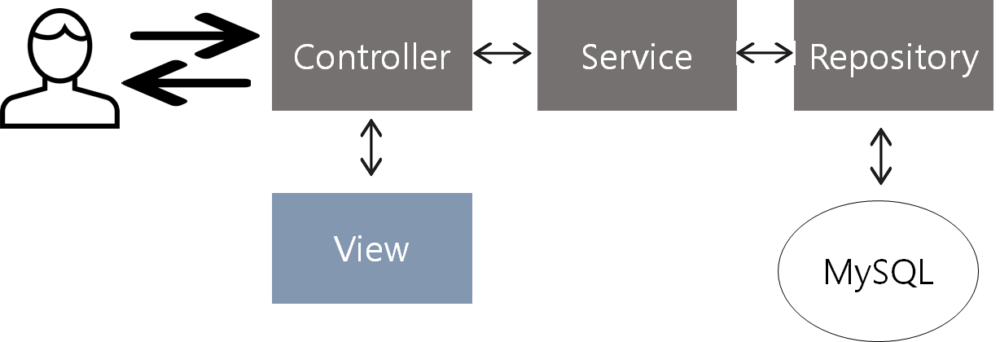
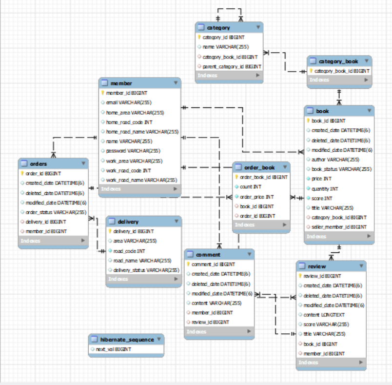

# 💡 프로젝트 소개

### SooBook

> 중고 책 거래 사이트
>

### 개발 기간

2022.09.18~(진행중)
   

# 💡 실행화면

[회원가입, 로그인, 판매, 주문, 리뷰 작성](https://www.youtube.com/watch?v=SNdy74XbPfQ&feature=youtu.be)

- 홈 화면에서 베스트셀러를 확인할 수 있다.
- 회원가입, 로그인을 하면 마이페이지를 볼 수 있고 로그아웃을 할 수 있다.
- 로그인 한 사용자만 책을 판매할 수 있다.
- 책을 사면 산 수량만큼 책 재고가 줄어든다.
- 구매한 책의 리뷰를 작성하면 책의 평점이 업데이트 된다.

 

[주문 취소](https://www.youtube.com/watch?v=N4A_q47xY18)
- 주문을 취소하면 책의 수량이 올라감.

   

# 💡 사용기술

### Front-End

- html, css
- thymeleaf
- bootstrap

### Back-End

- java11
- spring boot
- jpa
- mysql

### Build Tool

- gradle

     

# 💡 요구사항, 기능 소개

### 회원

- 회원은 회원가입, 로그인 할 수 있다.
- 로그인 한 회원은 마이페이지에서 자신의 주문 정보, 판매 정보, 리뷰 정보를 볼 수 있다.
- 이메일이 같은 회원은 있을 수 없다.

### 책

- 로그인 한 회원은 책을 판매할 수 있다.
- (책의 평점) == (리뷰들 평점의 평균)

### 주문

- 로그인 한 회원만 주문할 수 있다.
- 주문 성공 시 책의 수량이 줄어든다.
- 주문 취소 시 책이 수량이 늘어난다.
- 재고가 없으면 주문을 할 수 없다.

### 리뷰

- 로그인 한 회원 중에서 해당 책을 구매한 회원만 리뷰를 작성할 수 있다.
- 리뷰를 삭제하면 리뷰에 달린 댓글들도 삭제된다.
     
# 💡 프로젝트 아키텍처

- **Controller**

  User의 요청을 받고 응답을 해주는 역할을 담당

- **Service**

  핵심적인 비즈니스 로직을 담고 있다. (주문, 회원가입 등)

- **Repository**

  dbms에 접근하여 데이터를 저장, 수정, 삭제, 선벼하는 역할을 담당

- **View**

  화면에 무언가를 보여주기 위한 역할을 담당

  타임리프를 활용한 html

<aside>
☑️ MVC 패턴으로 레이어를 나눔으로써 비지니스 처리 로직과 사용자 인터페이스 요소들을 분리시켜 서로 영향없이 개발하였다.

</aside>

   

# 💡 엔티티 구조

- 엔티티들은 서로 일대일 연관관계 혹은 다대일 연관관계를 맺고있다.
- ‘다’에 해당하는 엔티티가 연관관계의 주인이며 외래키가 존재한다.

- `Category` : subCategories 속성과 parentCategory 속성이 다대일 관계이다. 연관관계 주인은 subCategories이며 데이터베이스에서 category 테이블이 self join을 하게 된다.
- `Address` : 임베디드 타입으로 쓰이며 Member 엔티티에서 homeAddress와 workAddress로 참조하고 있다.
- `Date` : Date는 jpa 영속성 컨텍스트에서 관리되는 엔티티는 아니며 `@MappedSuperclass` 어노테이션이 붙은 클래스이다. 객체의 입장에서 공통매핑정보를 사용하기 위해 쓰인다. 위 엔티티 구조에서는 Review, Comment, Book 에서 상속받아 쓰고 있다.
- `CategoryBook` : Category와 Book 엔티티가 다대다 관계인데 다대다는 구현이 복잡하고 수정이 어렵기 때문에 중간에 매핑테이블을 두기 위해 만든 엔티티이다.

   

# 💡 데이터베이스 구조

- 각 테이블의 pk인 id는 auto_increment 방식으로 의미 없는 값을 자동 생성하게 만들었다.
- `order` 가 예약어라서 테이블명으로 orders라는 이름을 사용했다.

   
